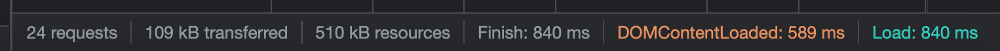

# Vending Machine with Statement

> [데모 사이트](https://oneny.github.io/vending-machine-with-statement/)

## 이전 프로젝트 및 공부 TIL

## 기능 구현

<details>
  <summary>Observer 만들기</summary>

- [코드 보러가기](https://github.com/oneny/vending-machine-with-statement/blob/main/src/js/core/observer.js#L3)

```js
let currentObserver = null;

export const observe = (fn) => {
  currentObserver = fn;
  fn();
  currentObserver = null;
};

export const observable = (obj) => {
  Object.keys(obj).forEach((key) => {
    let _value = obj[key];
    const observers = new Set();

    Object.defineProperty(obj, key, {
      get() {
        if (currentObserver) observers.add(currentObserver); // 구독자 등록
        return _value;
      },
      set(value) {
        // 숫자, 문자열, null, undefined 등의 원시 타입 상태가 같은 경우 방지
        if (_value === value) return;
        // 객체, 배열 똑같은 상태인 경우 방지
        if (JSON.stringify(_value) === JSON.stringify(value)) return;
        
        // 상태 바뀌면 저장 후 observers에 저장된 함수 실행
        _value = value; // 클로저를 활용해 _value를 유지하면서 값 변경
        observers.forEach((fn) => fn()); // 구독자(옵저버)에게 알리기
      },
    });
  });

  return obj;
};
```

- Observer Pattern은 객체의 상태 변화를 관찰하는 관찰자들, 즉 옵저버들의 목록을 객체에 등록하여 `상태 변화가 있을 때마다 메서드 등을 통해 객체가 직접 목록의 각 옵저버에게 통지하도록 하는 디자인 패턴`이다.
  - [공부 TIL](https://github.com/oneny/TIL/blob/main/JavaScript/%EB%94%94%EC%9E%90%EC%9D%B8%ED%8C%A8%ED%84%B4_%EA%B8%B0%EC%B4%88/%EC%9E%90%EB%B0%94%EC%8A%A4%ED%81%AC%EB%A6%BD%ED%8A%B8_%EB%94%94%EC%9E%90%EC%9D%B8_%ED%8C%A8%ED%84%B4.md#%EC%98%B5%EC%A0%80%EB%B2%84-%ED%8C%A8%ED%84%B4observer-pattern)
- observable에 변화가 생기면, observers에 등록된 함수 실행되도록 작성했다.
- state의 property가 사용될 때(= `get` 메서드가 실행될 때) currentObserver를 observers에 `등록`한다.
* state의 property가 변경될 때(= `set` 메서드가 실행될 때) observers에 등록된 모든 observers를 `실행`한다.
  ```js
  if (_value === value) return;
  if (JSON.stringify(_value) === JSON.stringify(value)) return;
  ```
  - 상태 변경 시 이전과 같은 상태들에 해당하는 컴포넌트들은 재렌더링되지 않도록 방지한다.

</details>

<details>
  <summary>Component 추상화</summary>

```js
import { observe } from "./observer.js";

export default class Component {
  state;
  props;
  $el;

  constructor($el, props) {
    this.$el = $el;
    this.props = props;
    this.setup(); 
  }

  setup() {
    observe(() => {
      this.render();
      this.setEvent();
      this.mounted();
    });
  }

  template() { return ""; }
  render() { this.$el.innerHTML = this.template(); }
  setEvent() {};
  mounted() {};
}
```

- `observe(() => { ... })`를 observe의 인자로 실행시키면 state의 property에 접근하는 과정에서 해당 콜백함수가 observers에 등록된다.
- 즉, 상태가 바뀌면 상태의 property와 관련된 컴포넌트가 재렌더링한다.

</details>

<details>
  <summary>Store - 전역 관리 시스템 구현</summary>

* [코드 보러가기](https://github.com/oneny/vending-machine-with-statement/blob/main/src/js/core/Store.js#L3)

```js
import { observable } from "./observer.js";

export const createStore = (reducer) => {
  // reducer가 실행될 때 반환하는 객체(state)를 observable로 만들어야 한다.
  const state = observable(reducer());

  // getState가 실제 state를 반환하는 것이 아니라 frozenState를 반환하도록
  const frozenState = {};
  Object.keys(state).forEach(key => {

    // set 접근자 프로퍼티는 작성하지 X, 직접적으로 접근하지 못하게 막기, 
    Object.defineProperty(frozenState, key, {
      get: () => state[key]
    });
  });

  // disptach로만 state의 값에 접근하여 변경할 수 있도록 한다.
  const dispatch = (action) => {
    const newState = reducer(state, action);

    for (const [key, value] of Object.entries(newState)) {
      // state의 key가 아닌 경우 변경 생략, 0인 경우도 걸리므로 조건 추가
      if (!state[key] && state[key] !== 0) continue;
      state[key] = value;
    }
  }

  // 값을 반환받을 수 있는(get) 접근자 프로퍼티만 있는 객체 반환
  const getState = () => frozenState;

  return { getState, dispatch };
}
```

- reducer를 콜백함수로 받아 observable 인자로 넘겨줄 때 실행시키면 default인 initState(아래 store에서 확인), 즉 초기 상태값을 observable에 인자로 넘어간다.
- state를 dispatch로만 값에 접근하여 변경할 수 있도록 한다.
- state를 지켜주기 위해 `getState`를 통해 프로퍼티의 값만 접근할 수 있는 객체를 만들고 이를 반환하도록 해서 컴포넌트에서 사용한다.

</details>

<details>
  <summary>store 사용하기</summary>

```js
import { createStore } from "./core/Store.js";
import colaItems from "./dummy/colaItems.js";
import cartItems from "./dummy/cartItems.js";
import myColaItems from "./dummy/myColaItems.js";

const initState = {
  isFilter: 0,
  colaItems,
  cartItems,
  myColaItems,
  myOwnMoney: 25000, // 소지금
  myBalance: 0, // 잔액
};

export const REDUCE_COLA = "REDUCE_COLA";
export const INCREASE_COLA = "INCREASE_COLA";

export const ADD_CART = "ADD_CART";
export const UPDATE_CART = "UPDATE_CART";
export const REDUCE_CART = "REDUCE_CART";
export const REMOVE_CART = "REMOVE_CART";

export const DEPOSIT_MONEY = "DEPOSIT_MONEY";
export const CREDIT_MONEY = "CREDIT_MONEY";
export const RETURN_MONEY = "RETURN_MONEY";
export const BUY_CARTITEMS = "BUY_CARTITEMS";

export const store = createStore((state = initState, action = {}) => {
  switch (action.type) {
    case INCREASE_COLA:
      return {
        ...state,
        colaItems: state.colaItems.map((item) =>
          item.id === action.payload
            ? { ...item, quantity: item.quantity + 1 }
            : item
        ),
      };
    case REDUCE_COLA:
      return {
        ...state,
        colaItems: state.colaItems.map((item) =>
          item.id === action.payload
            ? { ...item, quantity: item.quantity - 1 }
            : item
        ),
      };
    case ADD_CART:
      const { id: colaId, name, price, source } = action.payload;
      return {
        ...state,
        cartItems: [
          ...state.cartItems,
          { colaId, name, price, source, quantity: 1 },
        ],
      };
    case UPDATE_CART:
      return {
        ...state,
        cartItems: state.cartItems.map((item) =>
          item.colaId === action.payload
            ? { ...item, quantity: item.quantity + 1 }
            : item
        ),
      };
    case REDUCE_CART:
      return {
        ...state,
        cartItems: state.cartItems.map((item) =>
          item.colaId === action.payload
            ? { ...item, quantity: item.quantity - 1 }
            : item
        ),
      };
    case REMOVE_CART:
      return {
        ...state,
        cartItems: state.cartItems.filter(
          ({ colaId }) => colaId !== action.payload
        ),
      };
    case DEPOSIT_MONEY:
      return {
        ...state,
        myOwnMoney: action.payload,
      };
    case CREDIT_MONEY:
      return {
        ...state,
        myOwnMoney: state.myOwnMoney - action.payload,
        myBalance: state.myBalance + action.payload,
      };
    case RETURN_MONEY:
      return {
        ...state,
        myOwnMoney: state.myOwnMoney + state.myBalance,
        myBalance: 0,
      };
    case BUY_CARTITEMS:
      const { cartItems, totalPrice } = action.payload;
      const myColaItemsId = state.myColaItems.map(({ colaId }) => colaId);

      let myColaItems = [...state.myColaItems];
      cartItems.forEach(({ colaId, name, quantity, source }) => {
        myColaItems = myColaItemsId.includes(colaId)
          ? myColaItems.map((myColaItem) =>
              myColaItem.colaId === colaId
                ? { ...myColaItem, quantity: myColaItem.quantity + quantity }
                : myColaItem
            )
          : [...myColaItems, { colaId, name, quantity, source }];
      });

      return {
        ...state,
        myBalance: state.myBalance - totalPrice,
        cartItems: [],
        myColaItems,
      };
    default:
      return initState;
  }
});
```

* 위에서 만든 createStore를 사용하여 store에는 `{ getState: f, dispatch: f }`가 있는 객체를 할당하고, 이를 활용해 dispatch로 상태를 변경하고, getState로 상태에 접근할 수 있다.

</details>

<details>
  <summary>자판기 음료수 목록 컴포넌트</summary>

```js
import Component from "../core/Component.js";
import { store, ADD_CART, UPDATE_CART, REDUCE_COLA } from "../store.js";

export default class ColaItems extends Component {
  template() {
    const { colaItems } = store.getState();

    return `
      ${colaItems.map(({ id, source, name, price, quantity }) => `
        <li data-id="${id}">
          <button
            class="btn-item ${quantity <= 0 && "sold-out"}"
            disable="${quantity <= 0 ? "true" : "false"}"
          >
            
            <strong class="txt-name">${name}</strong>
            <span class="txt-price">${price}</span>
            ${quantity <= 0 ? `
              
            ` : ""}
          </button>
        </li>
      `).join("")}
    `;
  }

  setEvent() {
    const { $el } = this;
    const { colaItems, cartItems } = store.getState();

    $el.querySelectorAll(".btn-item").forEach((item) => {
      item.addEventListener("click", ({ target }) => {
        const cola = colaItems.find((item) =>
          item.id === target.closest("[data-id]").dataset.id);
        const cartItemIndex = cartItems.findIndex((item) =>
          item.colaId === target.closest("[data-id]").dataset.id);

        if (cartItemIndex === -1) {
          store.dispatch({ type: ADD_CART, payload: cola });
        } else {
          store.dispatch({
            type: UPDATE_CART,
            payload: target.closest("[data-id]").dataset.id,
          })
        }

        store.dispatch({
          type: REDUCE_COLA,
          payload: target.closest("[data-id]").dataset.id,
        })
      });
    })
  }
}
```

- 위에서 살펴본 `createStore`를 사용해 그 결과가 반환된 store를 사용하여 getState로 상태에 접근하고, dispatch로 상태를 변경하도록 작성한 것을 확인할 수 있다.
- `li`요소에 dataset 속성을 사용하여 dispatch에 해당 아이디를 넘겨주면서 콜라 수량을 줄이고, 카트에 해당 콜라를 담을 수 있도록 로직을 작성했다.

</details>

## 트러블 슈팅

[자바스크립트 객체와 증감 연산자](https://velog.io/@oneny/%EC%9E%90%EB%B0%94%EC%8A%A4%ED%81%AC%EB%A6%BD%ED%8A%B8-%EA%B0%9D%EC%B2%B4%EC%99%80-%EC%A6%9D%EA%B0%90-%EC%97%B0%EC%82%B0%EC%9E%90)

<details>
  <summary>모듈 번들링을 통한 요청 개수 줄이기</summary>

  - [공부 TIL](https://github.com/oneny/TIL/blob/main/React/%EC%9B%B9%ED%8C%A9.md)
  - Webpack에 대해서 공부하고, 사용할 곳을 찾아보다 JS파일이 많아져 좀 느려진 벤딩머신 토이 프로젝트에 적용해보면 좋을 것 같다는 생각이 들었다.
  - Webpack에서 특별하게 사용한 것은 없고, 정말 모듈 번들링을 통해 요청 개수만 줄여도 페이지가 좀 더 빠르게 렌더링하는지 보기 위해서 적용해봤다.

  
  

</details>

## 프로젝트 후기

이전 같은 프로젝트에서는 JS 로직을 짤 때 상태가 바뀌면 HTML 요소가 어떻게 반응하는지 그 결과까지 작성해 줘야 했던 것과는 달리 상태에 반응하도록 컴포넌트를 만듦으로써 상태만 바뀌면 자동으로 해당 컴포넌트가 반응되도록 만들었다. 그리고 좀 더 심화적으로 전역으로 상태 관리할 수 있는 시스템을 만들어 컴포넌트 밖에서 상태를 관리할 수 있도록 만들어본 것이 매우 좋은 경험이었다.
